---
# try also 'default' to start simple
theme: seriph
# random image from a curated Unsplash collection by Anthony
# like them? see https://unsplash.com/collections/94734566/slidev
background: https://source.unsplash.com/collection/94734566/1920x1080
# apply any windi css classes to the current slide
class: 'text-center'
# https://sli.dev/custom/highlighters.html
highlighter: shiki
# show line numbers in code blocks
lineNumbers: false
# some information about the slides, markdown enabled
info: |
  ## 从MLP到深度学习框架
  Presentation by 高崧淇.
  https://github.com/gsq7474741
# persist drawings in exports and build
drawings:
  persist: false
# use UnoCSS
css: unocss
---

# 从MLP到深度学习框架

高崧淇
2022.11.25

<div class="pt-12">
  <span @click="$slidev.nav.next" class="px-2 py-1 rounded cursor-pointer" hover="bg-white bg-opacity-10">
    Press Space for next page <carbon:arrow-right class="inline"/>
  </span>
</div>

<div class="abs-br m-6 flex gap-2">
  <button @click="$slidev.nav.openInEditor()" title="Open in Editor" class="text-xl icon-btn opacity-50 !border-none !hover:text-white">
    <carbon:edit />
  </button>
  <a href="https://github.com/slidevjs/slidev" target="_blank" alt="GitHub"
    class="text-xl icon-btn opacity-50 !border-none !hover:text-white">
    <carbon-logo-github />
  </a>
</div>

<!--
The last comment block of each slide will be treated as slide notes. It will be visible and editable in Presenter Mode along with the slide. [Read more in the docs](https://sli.dev/guide/syntax.html#notes)
-->

---

# 人工智能与深度学习

我们尝试让机器学会思考，但机器真的会思考吗？机器怎么思考？
我们追求的智能究竟是什么？


<!-- AI技术究竟是什么，又经历了怎样的发展历程呢。
大家知道，人工智能经过了大几十年的发展，从四五十年代开始到现在已经经历了三次浪潮。一般会认为，现在所处的是人工智能的第三波浪潮当中。第三波浪潮当中里面有一个非常核心的驱动力，大家一般叫它深度学习。
这里先给大家普及AI常用的三个概念：人工智能、机器学习、深度学习
人工智能：能够感知、推理、行动和适应的程序
机器学习：能够随着数据量的增加不断改进性能的算法。现在人工智能的实现主要途径是通过计算机从数据中学习。
深度学习：机器学习的一个子集，是机器学习的一种方式：利用多层神经网络从大量数据中进行学习

深度学习虽然是第三波驱动力，但是它本身的萌芽发展也经过了很多年，从理论的突破到技术上的突破，再到应用上的突破，再到今天行业的应用和更广泛的社会影响，其实它经过很长时间。近些年算力、数据、和算法方面的大规模提升和突破，使得人工智能深度学习能实现大规模的应用落地。

深度学习这几年应用越来越多，可能有一个标志性的事件大家都知道，就是阿尔法狗。2016年基于深度学习的阿尔法狗当时击败了人类冠军，使大家对深度学习的了解越来越多。
 -->

---


# MLP


---
layout: image-right
image: https://source.unsplash.com/collection/94734566/1920x1080
---
# MLP as ML model
```python{1-3|4-11|12-17|all}
# 数据
X = np.array([[0,0],[0,1], [1,0],[1,1]])
T = np.array([[0],[1],[1],[0]])

# 定义一个2层的神经网络：2-10-1
# 输入层2个神经元，隐藏层10个神经元，输出层1个神经元

W1 = np.random.random([2,10])
W2 = np.random.random([10,1])
b1 = np.zeros([10])
b2 = np.zeros([1])

def sigmoid(x):
 return 1 / (1 + np.exp(-x))
# 定义sigmoid函数导数
def dsigmoid(x):
 return x * (1 - x)
```


---
layout: image-right
image: https://source.unsplash.com/collection/94734566/1920x1080
---

# MLP as ML model

```python {3-5|7-11|12-17|all}
def update():
 global X, T, W1, W2, lr, b1, b2
# forward
 L1 = sigmoid(np.dot(X, W1) + b1)
 L2 = sigmoid(np.dot(L1, W2) + b2)
# calculate gradient
 delta_L2 = (T - L2) * dsigmoid(L2)
 delta_L1 = delta_L2.dot(W2.T) * dsigmoid(L1)

 delta_W2 = lr * L1.T.dot(delta_L2) / X.shape[0]
 delta_W1 = lr * X.T.dot(delta_L1) / X.shape[0]
 # update weight
 W2 = W2 + delta_W2
 W1 = W1 + delta_W1

 b2 = b2 + lr * np.mean(delta_L2, axis=0)
 b1 = b1 + lr * np.mean(delta_L1, axis=0)

```

---
layout: fact
---

# 扩展性?

更多的层？
更多的函数？
不同优化器？


---
layout: statement
---
# 机器学习的一般流程

```mermaid {scale: 1.5}
graph LR
B[数据处理] --> C[模型构建]
C --> D[模型训练]
```



---

# 反向传播范式下的数据流

```mermaid {scale:1}
graph TD
D[数据加载器] --data--> M[模型] -- output--> G
G[梯度计算] -.grad.-> O[优化器] -.delta.-> M
M -- output--> ACC[精度评估]

```



---


---


# What is Slidev?

Slidev is a slides maker and presenter designed for developers, consist of the following features

- 📝 **Text-based** - focus on the content with Markdown, and then style them later
- 🎨 **Themable** - theme can be shared and used with npm packages
- 🧑‍💻 **Developer Friendly** - code highlighting, live coding with autocompletion
- 🤹 **Interactive** - embedding Vue components to enhance your expressions
- 🎥 **Recording** - built-in recording and camera view
- 📤 **Portable** - export into PDF, PNGs, or even a hostable SPA
- 🛠 **Hackable** - anything possible on a webpage

<br>
<br>

Read more about [Why Slidev?](https://sli.dev/guide/why)

<!--
You can have `style` tag in markdown to override the style for the current page.
Learn more: https://sli.dev/guide/syntax#embedded-styles
-->

<style>
h1 {
  background-color: #2B90B6;
  background-image: linear-gradient(45deg, #4EC5D4 10%, #146b8c 20%);
  background-size: 100%;
  -webkit-background-clip: text;
  -moz-background-clip: text;
  -webkit-text-fill-color: transparent;
  -moz-text-fill-color: transparent;
}
</style>

<!--
Here is another comment.
-->

---

# Navigation

Hover on the bottom-left corner to see the navigation's controls panel, [learn more](https://sli.dev/guide/navigation.html)

### Keyboard Shortcuts

|     |     |
| --- | --- |
| <kbd>right</kbd> / <kbd>space</kbd>| next animation or slide |
| <kbd>left</kbd>  / <kbd>shift</kbd><kbd>space</kbd> | previous animation or slide |
| <kbd>up</kbd> | previous slide |
| <kbd>down</kbd> | next slide |

<!-- https://sli.dev/guide/animations.html#click-animations -->

<p v-after class="absolute bottom-23 left-45 opacity-30 transform -rotate-10">Here!</p>

---
layout: image-right
image: https://source.unsplash.com/collection/94734566/1920x1080
---

# Code

Use code snippets and get the highlighting directly![^1]

```ts {all|2|1-6|9|all}
interface User {
  id: number
  firstName: string
  lastName: string
  role: string
}

function updateUser(id: number, update: User) {
  const user = getUser(id)
  const newUser = { ...user, ...update }
  saveUser(id, newUser)
}
```

<arrow v-click="3" x1="400" y1="420" x2="230" y2="330" color="#564" width="3" arrowSize="1" />

[^1]: [Learn More](https://sli.dev/guide/syntax.html#line-highlighting)

<style>
.footnotes-sep {
  @apply mt-20 opacity-10;
}
.footnotes {
  @apply text-sm opacity-75;
}
.footnote-backref {
  display: none;
}
</style>

---

# Components

<div grid="~ cols-2 gap-4">
<div>

You can use Vue components directly inside your slides.

We have provided a few built-in components like `<Tweet/>` and `<Youtube/>` that you can use directly. And adding your custom components is also super easy.

```html
<Counter :count="10" />
```

<!-- ./components/Counter.vue -->
<Counter :count="10" m="t-4" />

Check out [the guides](https://sli.dev/builtin/components.html) for more.

</div>
<div>

```html
<Tweet id="1390115482657726468" />
```

<Tweet id="1390115482657726468" scale="0.65" />

</div>
</div>

<!--
Presenter note with **bold**, *italic*, and ~~striked~~ text.

Also, HTML elements are valid:
<div class="flex w-full">
  <span style="flex-grow: 1;">Left content</span>
  <span>Right content</span>
</div>
-->


---
class: px-20
---

# Themes

Slidev comes with powerful theming support. Themes can provide styles, layouts, components, or even configurations for tools. Switching between themes by just **one edit** in your frontmatter:

<div grid="~ cols-2 gap-2" m="-t-2">

```yaml
---
theme: default
---
```

```yaml
---
theme: seriph
---
```


</div>

Read more about [How to use a theme](https://sli.dev/themes/use.html) and
check out the [Awesome Themes Gallery](https://sli.dev/themes/gallery.html).

---
preload: false
---

# Animations

Animations are powered by [@vueuse/motion](https://motion.vueuse.org/).

```html
<div
  v-motion
  :initial="{ x: -80 }"
  :enter="{ x: 0 }">
  Slidev
</div>
```

<div class="w-60 relative mt-6">
  <div class="relative w-40 h-40">
    
    
    
  </div>

  <div
    class="text-5xl absolute top-14 left-40 text-[#2B90B6] -z-1"
    v-motion
    :initial="{ x: -80, opacity: 0}"
    :enter="{ x: 0, opacity: 1, transition: { delay: 2000, duration: 1000 } }">
    Slidev
  </div>
</div>

<!-- vue script setup scripts can be directly used in markdown, and will only affects current page -->
<script setup lang="ts">
const final = {
  x: 0,
  y: 0,
  rotate: 0,
  scale: 1,
  transition: {
    type: 'spring',
    damping: 10,
    stiffness: 20,
    mass: 2
  }
}
</script>

<div
  v-motion
  :initial="{ x:35, y: 40, opacity: 0}"
  :enter="{ y: 0, opacity: 1, transition: { delay: 3500 } }">

[Learn More](https://sli.dev/guide/animations.html#motion)

</div>

---

# LaTeX

LaTeX is supported out-of-box powered by [KaTeX](https://katex.org/).

<br>

Inline $\sqrt{3x-1}+(1+x)^2$

Block
$$
\begin{array}{c}

\nabla \times \vec{\mathbf{B}} -\, \frac1c\, \frac{\partial\vec{\mathbf{E}}}{\partial t} &
= \frac{4\pi}{c}\vec{\mathbf{j}}    \nabla \cdot \vec{\mathbf{E}} & = 4 \pi \rho \\

\nabla \times \vec{\mathbf{E}}\, +\, \frac1c\, \frac{\partial\vec{\mathbf{B}}}{\partial t} & = \vec{\mathbf{0}} \\

\nabla \cdot \vec{\mathbf{B}} & = 0

\end{array}
$$

<br>

[Learn more](https://sli.dev/guide/syntax#latex)

---

# Diagrams

You can create diagrams / graphs from textual descriptions, directly in your Markdown.

<div class="grid grid-cols-3 gap-10 pt-4 -mb-6">


</div>

[Learn More](https://sli.dev/guide/syntax.html#diagrams)

---
src: ./pages/multiple-entries.md
hide: false
---

---
layout: center
class: text-center
---

# Learn More

[Documentations](https://sli.dev) · [GitHub](https://github.com/slidevjs/slidev) · [Showcases](https://sli.dev/showcases.html)
